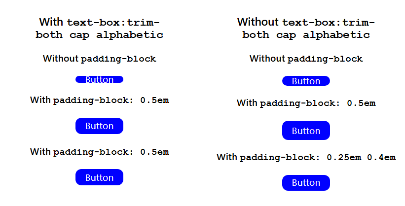
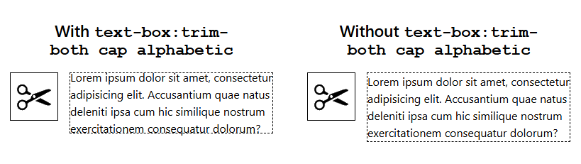
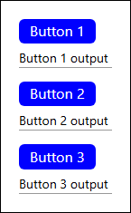

# Code Snippets

---

<details>
  <summary><strong id="menu">Menu</strong></summary>

## HTML

- [Correct use of the HTML `section` tag.](#correct-use-of-the-html-section-tag)

---

## CSS

- [Target `class` Prefixes and Suffixes with `|` and `$` Selectors](#target-class-prefixes-and-suffixes-with--and--selectors)
- [Target external links with `a[href^="https"]`](#target-external-links-with-ahrefhttps)
- [CSS Variables with JavaScript: Toggle background colour](#css-variables-with-javascript-toggle-background-colour)
- [Perfectly-rounded buttons](#perfectly-rounded-buttons)
- [@media (hover: hover)](#media-hover-hover)
- [Typographical Flow](#typographical-flow)
- [Centred, Variable Max-width Container](#centred-variable-max-width-container)
- [Centre absolutely positioned ::after element](#centre-absolutely-positioned-after-element)
- [Pixels to Rems](#pixels-to-rems)
- [Nested Grid Unusual Behaviour Fixed by `min-width:0`](#nested-grid-unusual-behaviour-fixed-by-min-width0)
- [CSS `text-box: trim-both cap alphabetic`](#css-text-box-trim-both-cap-alphabetic)
- [The modern way to clear floats: `display: flow-root`](#the-modern-way-to-clear-floats-display-flow-root)
- [CSS `box-shadow` applied to only one side](#css-box-shadow-applied-to-only-one-side)
- [Invert image (darkmode / lightmode)](#invert-image-darkmode--lightmode)
- [Main Navigation Items Centred, Secondary Items Aligned Right](#main-navigation-items-centred-secondary-items-aligned-right)

---

## JavaScript

- [Update Multiple Attributes](#update-multiple-attributes)
- [Set Multiple Attributes (Deprecated)](#set-multiple-attributes-deprecated)
- [Global Event Listener](#global-event-listener)
- [If, if/else statement vs Conditional (ternary) operator](#if-ifelse-statement-vs-conditional-ternary-operator)
- [Quick Fix for 'Uncaught TypeError: ITEM is undefined'](#quick-fix-for-uncaught-typeerror-item-is-undefined)
- [`Math.ceil(Math.random() * n)`: Explanation](#mathceilmathrandom--n-explanation)
- [String Manipulation](#string-manipulation)
- [Multiple button instances that act independently of each other](#multiple-button-instances-that-act-independently-of-each-other)
- [Check if element is in DOM with `.isConnected` then `.remove()` element](#check-if-element-is-in-dom-with-isconnected-then-remove-element)
- [Use `.some()`array method to check if at least one element matches a condition](#use-somearray-method-to-check-if-at-least-one-element-matches-a-condition)
- [`loading="lazy"` for all images, except the first](#loadinglazy-for-all-images-except-the-first)
- [Workaround for Read-Only Imports in ES Modules: Getter/Setter Pattern](#workaround-for-read-only-imports-in-es-modules-gettersetter-pattern)
- [Set `input type="date"` to Current Date](#set-input-typedate-to-current-date)
- [`textarea` Character Counter](#textarea-character-counter)

### Local Storage

- [Copy Local Storage to JSON](#copy-local-storage-to-json)
- [Clear local storage](#clear-local-storage)
- [Delete Local Storage Keys](#delete-local-storage-keys)
- [Save Button Toggle Text to Local Storage](#save-button-toggle-text-to-local-storage)

---

## Accessibility

- [No JS](#no-js)
- [Accessible details/summary 'accordion'](#accessible-detailssummary-accordion)
- [Accessible details/summary 'accordion' group](#accessible-detailssummary-accordion-group)
- [Get Selected Option Value and Text](#get-selected-option-value-and-text)
- [Safari and List Semantics](#safari-and-list-semantics)

---

## React

- [React Proptypes for Image Src](#react-proptypes-for-image-src)
- [React Proptypes and Default Proptypes for an Array of Objects](#react-proptypes-and-default-proptypes-for-an-array-of-objects)
- [React Button Component with props](#react-button-component-with-props)
- [Temporarily Disable PropTypes](#temporarily-disable-proptypes)
- [React Router v6: 'end' replaces 'exact' in NavLink](#react-router-v6-end-replaces-exact-in-navlink)
- [Vite/React: Dynamic Image Paths](#vitereact-dynamic-image-paths)
- [Pass Object as `Props`](#pass-object-as-props)
- [Simple Array: Use second `index` Parameter of `.map()` Method to Supply Component's `key` Value](#simple-array-use-second-index-parameter-of-map-method-to-supply-components-key-value)
- [Get Random URL from an Array of Objects](#get-random-url-from-an-array-of-objects)
- [Set Array State](#set-array-state)
- [Set Object State](#set-object-state)
- [Setting State from Child Components](#setting-state-from-child-components)
- [`useEffect()` Clean Up Function](#useeffect-clean-up-function)
- [`useState()` or `useState()` and `useEffect()`? Style-switcher Example](#usestate-or-usestate-and-useeffect-style-switcher-example)
- [Get and Map Data with `async await` and `.map()`](#get-and-map-data-with-async-await-and-map)
- [Loading Component with Animated Spinner](#loading-component-with-animated-spinner)
- [Set Page Title with Component](#set-page-title-with-component)

---

## Git

- [Git new branch: create, merge, delete, push](#git-new-branch-create-merge-delete-push)
- [Deleting Git](#deleting-git)
- [Resolving Git Conflicts](#resolving-git-conflicts)
- [GitHub Markdown: Notes and Warnings](#github-markdown-notes-and-warnings)
- [GitHub Markdown: Add image to README.md](#github-markdown-add-image-to-readmemd)
- [GitHub Dependabot pull requests fail (because of outdated `deploy.yml`)](#github-dependabot-pull-requests-fail-because-of-outdated-deployyml))
- [GitHub Pages: publish from `/docs` after bundling JS and minifying CSS](#github-pages-publish-from-docs-after-bundling-js-and-minifying-css)
- [Post Dependabot PR Merge Local Workflow](#post-dependabot-pr-merge-local-workflow)

---

## Command Line

- [Get IPv4 Address](#get-ipv4-address)
- [Clear DNS cache](#clear-dns-cache)
- [Delete `node_modules` via PowerShell](#delete-node_modules-via-powershell)

---

## Windows 10/11

- [Create New User Profile](#create-new-user-profile)
- [Repair System Files (DISM + SFC)](#repair-system-files-dism--sfc)

---

## Windows 11

- [Delete old Windows Update files](#delete-old-windows-update-files)
- [Weekly Check for ID 17 and IDs 18, 19 Events (Uncorrected Hardware Errors) in System Logs](#weekly-check-for-id-17-and-ids-18-19-events-uncorrected-hardware-errors-in-system-logs)

---

## ChatGPT (Free Version

- [Tips for Prompt Structure & Reminders to Keep it On Track](#tips-for-prompt-structure--reminders-to-keep-chatgpt-free-version-on-track)
- [Tip for when the chat input field lags](#tip-for-when-the-chatgpt-free-version-input-field-lags)

</details>

---

## Correct use of the HTML `section` tag.

Without, e.g. `aria-labelledby="section-title">` and `<h2 id="section-title">Section Title</h2>` the `section` element has **no semantic significance** and might as well be a `div`.

(The `aria-labelledby` attribute identifies the element (or elements) that labels the element it is applied to.)

```html
<section aria-labelledby="section-title">
  <h2 id="section-title">Section Title</h2>
  <p>Lorem ipsum...</p>
</section>
```

[Back to menu](#menu)

---

## Target `class` Prefixes and Suffixes with `|` and `$` Selectors

### Prefixes, e.g. `[class|="button"]`

The generic button styles will be applied to any class with prefix 'button'.

```css
[class|="button"] {
  /* Generic button styles */
  background-color: blue;
  color: white;
  border-width: 1px solid transparent;
}

.button-add {
  /* button add specific styles */
  border-color: green;
}
.button-delete {
  /* button delete specific styles */
  border-color: red;
}
```

### Suffixes, e.g. `[class$="button"]`

The generic button styles will be applied to any class with suffix 'button'.

```css
[class$="button"] {
  /* Generic button styles */
  background-color: red;
  color: white;
  border-width: 1px solid transparent;
}

.add-button {
  /* button add specific styles */
  border-color: purple;
}
.delete-button {
  /* button delete specific styles */
  border-color: white;
}
```

> [!IMPORTANT]
> If you simply had a class of "button" on an element (`<button class="button">Button</button>`) then both selectors would try to apply the generic styles (and the last one defined would win). Better not to have such a monosyllabic class, but if you do, don't use the prefix and suffix selectors).

[Back to menu](#menu)

---

## Target external links with `a[href^="https"]`

```css
a[href^="https"] {
  color: var(--accent-colour);
  text-underline-offset: 0.5em;

  &::after {
    color: var(--accent-colour);
    content: " \27F6";
  }
}
```

[Back to menu](#menu)

---

## CSS Variables with JavaScript: Toggle background colour

Manipulate a CSS variable with JavaScript.

### 1) Add `style` attribute to `html` tag:

```HTML
<!DOCTYPE html>
<html lang="en" style>
<head>
...
</head>
<body>
    <button id="change-body-bg" type="button">Toggle background colour of page</button>
</body>
</html>
```

### 2) Set up the CSS variables:

```CSS
:root {
    --body-bg: white;
    --body-bg-alt: beige;
}
body {
    background-color: var(--body-bg);
}
```

### 3) Manipulate the CSS variables using `.style.setProperty()`:

```JavaScript
const root = document.querySelector("html")
const bodyBgVal = "--body-bg"
const bodyBgAltVal = "var(--body-bg-alt)"
const btnChangeBodyBg = document.getElementById("change-body-bg")

btnChangeBodyBg.addEventListener("click", () => {
    root.getAttribute("style") === ""
        ? root.style.setProperty(bodyBgVal, bodyBgAltVal)
        : root.style.setProperty(bodyBgVal, null)
})
```

### Output

```HTML
<!-- On first click: -->
<html lang="en" style="--body-bg: var(--body-bg-alt);">

<!-- On toggle: -->
<html lang="en" style>

<!-- Etc. -->
```

[Back to menu](#menu)

---

## Perfectly-rounded buttons

```HTML
<button type="button">Button</button>
```

```CSS
*,
*::after,
*::before {
    box-sizing: border-box;
}

html {
    font-size: 10px;
}

button {
    all: unset;
    background: blue;
    color: white;
    font-family: system-ui;
    font-weight: 600;
    font-size: 2rem;
    padding: 1.6rem 2.4rem;

    /**
      Perfectly rounded left and right edges:
    **/
    border-radius: 100vw;
}
```

[Back to menu](#menu)

---

## `@media (hover: hover)`

Targets only those devices which support `:hover` and excludes those which don't, e.g., mobiles and tablets.

Useful if you find that a `:hover` state 'sticks' on mobile/tablet.

```CSS
li a {
    border-bottom: 5px solid blue;
}

/* Excludes mobiles and tablets from trying to :hover */
@media (hover: hover) {
    li a:hover {
        border-bottom-color: red;
    }
}
```

[Back to menu](#menu)

---

## Typographical Flow

### `flow-em`

- Use for spacing mixed elements (h1,h2,h3, p, etc.) inside a container

The `flow-em` class will:

- add `margin-block-start: 1em` (aka `margin-top`) to _all_ elements _after_ the first child of the container,
- space the elements out proportionately, based on the font-size of the elements (which is why `em` rather than `rem` is used).

```CSS
* {
    margin: 0;
}

.flow-em > * + * {
    margin-block-start: 1em;
    /* em NOT rem & margin-top NOT margin bottom */
}
```

```HTML
<article class="flow-em">
    <h2>Main Heading</h2><!-- NO margin-top -->
    <p>Some text.</p><!-- HAS margin-top -->
    <p>Some text.</p><!-- HAS margin-top -->
    <p>Some text.</p><!-- HAS margin-top -->
    <!-- etc -->
</article>

```

You can make `flow-em` more flexible by adding a custom variable:

```CSS
.flow-em > * + * {
    margin-block-start: var(--flow-space, 1em);
}
```

Then you could change the `margin-block-start` value with an inline style:

```HTML
<article class="flow-em" style="--flow-space: 1.5em;">
    <h2>Main Heading</h2>
    <p>Some text.</p>
    <p>Some text.</p>
    <p>Some text.</p>
    <!-- etc -->
</article>

```

### `flow-rem`

Almost identical to `flow-em`, but this time using `rem` units.

Use for spacing child containers:

```CSS
.flow-rem > * + * {
    margin-block-start: 1rem;
}
```

```HTML
<article class="flow-rem">
    <div>...</div>
    <div>...</div>
    <div>...</div>
    <div>...</div>
    <!-- etc -->
</article>

```

Or:

```CSS
.flow-rem > * + * {
    margin-block-start: var(--flow-space, 1rem);
}
```

```HTML
<article class="flow-rem" style="--flow-space:1.5rem">
    <div>...</div>
    <div>...</div>
    <div>...</div>
    <div>...</div>
    <!-- etc -->
</article>

```

[Back to menu](#menu)

---

## Centred, Variable Max-width Container

Ensures space on the left and right of the container once the `max-width` threshold has been crossed.

Note: No padding required on the container.

```CSS
* {
    box-sizing: border-box;
}

html {
    font-size: 10px;
}

.container {
    /* Locally-scoped CSS variables */
    --_content-max-width: 120rem; /* i.e. 120 X 10px = 1200px */
    --_content-space-outside: 2rem;

    width: min(var(--_content-max-width), 100% - var(--_content-space-outside) * 2);
    margin-inline: auto;
}
```

```HTML
<article class="container">
    <h2>Main Heading</h2>
    <p>Some text.</p>
    <p>Some text.</p>
    <p>Some text.</p>
</article>
```

[Back to menu](#menu)

---

## Centre absolutely positioned `::after` element

Centres both vertically and horizontally.

To only centre horizontally, use `margin-inline: auto;` in place of `margin: auto;`.

[Demo on CodePen](https://codepen.io/Naj-codepen/pen/LYvPvNo)

```HTML
<div class="container"></div>
```

```CSS
*,
*::after,
*::before {
    box-sizing: border-box;
}

html {
    font-size: 10px;
}

.container {
    position: relative;
    width: 10rem;
    aspect-ratio: 1;

    /* Styling */
    background: #000;
    border-radius: 100vw;
    padding: 1.6rem 2rem;
}

.container::after {
    position: absolute;
    width: max-content;
    height: max-content;
    inset: 0;
    /*
        Center horizontally:
        margin-inline: auto;
    */

    /* Center both vertically and horizontally: */
    margin: auto;

    /* Styling */
    font-size: 4rem;
    content: "\2705";
}
```

[Back to menu](#menu)

---

## Pixels to Rems

Previously, I've addressed this by setting `font-size: 10px` in `root:`, then setting `rems` in the following way, e.g:

- `font-size: 1.6rem` (= 16px)
- `width: 72rem` (= 720px)
- `padding: 0.8rem 1.2rem` (= 8px, 12px)

etc, etc.

This was to avoid having to calculate `rems` each time I wrote a CSS rule based on the browser's base font size of 16px.

However, I found this method had accessibility concerns: If a user sets his font size settings to, e.g. "Large", the page won't respond.

### Solution

**Assumption**: You're using VSCode Editor.

- Install VSCode extension ["Convert px to rem"](https://marketplace.visualstudio.com/items?itemName=gwanduke.convert-px-to-rem)
- During development, write all CSS using pixels.

When you're ready to publish:

- `Ctrl+Shift+P` or `Cmd+Shift+P`, type "convert px to rem", then hit the `Enter` key.

**Result**: All pixel values will now be converted to `rems`.

> [!NOTE]
> I recommend making a copy of the CSS file before you convert (and saving it as, e.g. "stylesPixels.css") so you have a reference if you want to make changes at a later date.

[Back to menu](#menu)

---

## Nested Grid Unusual Behaviour Fixed by `min-width:0`

### 1) `items` Grid

I inserted the following code into an HTML page:

```html
<div class="items">
  <div class="item">Item</div>
  <div class="item">Item</div>
  <div class="item">Item</div>
  <div class="item">Item</div>
  <div class="item">Item</div>
  <!-- etc, etc up to 20 items -->
</div>
```

I then applied the following CSS:

```css
.items {
  display: grid;
  grid-template-columns: repeat(auto-fit, minmax(180px, 1fr));
  gap: 10px;
  max-width: 1270px;
}

.item {
  aspect-ratio: 3 / 2;
  display: flex;
  align-items: center;
  justify-content: center;
  background-color: blue;
}
```

This worked as expected: On wide screens, the items were laid out in columns of 6. Making the window progressively smaller rendered columns of 5, 4, 3, 2 and 1.

### 2) `page-layout` grid.

To layout a page that ensures that the 'footer' always stays at the bottom I always use the following HTML/CSS:

```html
<div class="page-layout">
  <header>Header</header>
  <main>Main content</main>
  <footer>Footer</footer>
</div>
```

```css
.page-layout {
  display: grid;
  grid-template-rows: auto 1fr auto;
  height: 100dvh;
  height: 100vh;
}
```

### 3) Nesting the `items` grid inside the `page-layout` grid

```html
<div class="page-layout">
  <header>Header</header>
  <main>
    <div class="items">
      <div class="item">Item</div>
      <div class="item">Item</div>
      <div class="item">Item</div>
      <div class="item">Item</div>
      <div class="item">Item</div>
      <!-- etc, etc up to 20 items -->
    </div>
  </main>
  <footer>Footer</footer>
</div>
```

**Result**: The `items` grid remained stuck at 6 columns. Narrowing the browser window caused the `item`s to first shrink, ultimately generating horizontal scrollbars when the space runs out.

This is because defining `.page-layout` as a grid container establishes a new grid formatting context. This affects how child elements inside it, including the `.items` grid, are sized and rendered.

### 4) Solution: Add `min-width: 0` to the `main` element

```css
main {
  min-width: 0;
}
```

#### Why `min-width: 0` works

- In a grid layout, items have a default `min-width: auto`. This causes the grid item (in this case, `main`) to be at least as wide as its content, preventing it from shrinking as the browser window shrinks.
- Setting `min-width: 0` allows the `main` element to shrink below its content width, thereby allowing the `.items` grid inside it to adjust and reduce the number of columns as the window narrows.

> [!NOTE]
> Both HTML pages had the usual `<meta name="viewport" content="width=device-width, initial-scale=1.0">` tag in the `head` section.

[Back to menu](#menu)

---

## CSS `text-box: trim-both cap alphabetic`

This trims the 'virtual space' above and below text. it is currently (20/05/2025) not widely supported.

It can be used to trim text over a whole page, but this is overkill.

The best candidates for its application are:

- Lining up the top edge of text with an accompanying image.
- Evening-up the space above and below button text (although this can cause complications in non-supporting browsers, see below).

### Button Complications

```CSS

button {
  all: unset; /* strips button of all default property values */
  text-box: trim-both cap alphabetic;
  padding-block: 0.5em;

  /* Other styles */
  padding-inline: 1em;
  width: fit-content;
  line-height: 1;
 }

```

#### Supported Browsers

The CSS above will successfully trim virtual space from above and below the button text. The `padding-block: 0.5em` will ensure that the text is evenly vertically spaced.

#### Unsupported Browsers

The button will be larger (taller), due to the vertical padding plus the virtual space. In order to counteract this, the following CSS might be used:

```CSS
@supports not (text-box: trim-both cap alphabetic) {
  button {
    padding-block: 0.25em 0.4em; /* These values will depend on which font is used */
  }
}

```



## Conclusion

- Lining up an image with text is the use-case with no fallbacks or magic numbers required: If the browser does not support the rule, you get what you have always got before.



- The problem with buttons has already been set out.
- Using it on all text blocks robs the page of the pleasing text rhythm supplied by the browser _and_ requires fallbacks for non-supported browsers.

[Back to menu](#menu)

---

## The modern way to clear floats: `display: flow-root`

```css
.container {
  /* Self-clear floated children */
  display: flow-root;
}

.floated-item {
  float: left;
  width: 100px;
  height: 100px;
}
```

```html
<div class="container">
  <div class="floated-item"></div>
  <div class="floated-item"></div>
</div>
```

Without `display: flow-root;` on `.container`, its height would collapse to zero.

[Back to menu](#menu)

---

## CSS `box-shadow` applied to only one side

### Quick Reference

| Direction | `box-shadow` Value              |
| --------- | ------------------------------- |
| Bottom    | `0 4px 6px rgba(0, 0, 0, 0.2)`  |
| Top       | `0 -4px 6px rgba(0, 0, 0, 0.2)` |
| Right     | `4px 0 6px rgba(0, 0, 0, 0.2)`  |
| Left      | `-4px 0 6px rgba(0, 0, 0, 0.2)` |

---

### Syntax

```css
box-shadow: offset-x offset-y blur-radius spread-radius color;
```

- `offset-x`: horizontal offset (positive = right, negative = left)
- `offset-y`: vertical offset (positive = bottom, negative = top)
- `blur-radius`: how soft/diffuse the shadow is
- `spread-radius`: (optional) expands or contracts the shadow
- `color`: shadow color (use `rgba()` for transparency)

---

### One-Sided Shadow Examples

##### Bottom-only shadow

```css
box-shadow: 0 4px 6px rgba(0, 0, 0, 0.2);
```

##### Top-only shadow

```css
box-shadow: 0 -4px 6px rgba(0, 0, 0, 0.2);
```

##### Right-only shadow

```css
box-shadow: 4px 0 6px rgba(0, 0, 0, 0.2);
```

##### Left-only shadow

```css
box-shadow: -4px 0 6px rgba(0, 0, 0, 0.2);
```

---

### Understanding the "length" of the shadow

The **6px** in the examples is the **blur radius**, not the literal length of the shadow in one direction.

- A **larger blur-radius** (e.g., `12px`) creates a softer, more spread-out shadow
- A **blur-radius of 0** creates a sharp edge

##### Crisp shadows:

```css
box-shadow: 0 4px 0 rgba(0, 0, 0, 0.3); /* Sharp bottom shadow */
```

##### Soft shadows:

```css
box-shadow: 0 4px 20px rgba(0, 0, 0, 0.2); /* Soft, long shadow */
```

---

### `spread-radius`

Use `spread-radius` (4th value) to expand or shrink the shadow size:

```css
box-shadow: 0 4px 6px 2px rgba(0, 0, 0, 0.2); /* 2px extra spread */
```

[Back to menu](#menu)

---

## Invert image (darkmode / lightmode)

```html

```

```css
:root {
  /* light mode (default) */
  --image-invert: 0;
}

.darkmode {
  --image-invert: 1;
}

.image-invert {
  filter: invert(var(--image-invert));
}
```

[Back to menu](#menu)

---

## Main Navigation Items Centred, Secondary Items Aligned Right

Previously, I'd tried (and failed) to achieve this using a single `<ul>`. Then the obvious solution presented itself: Put the secondary links into their own `<ul>` (which is still perfectly semantic):

```html
<div class="navigation">
  <nav>
    <!-- Main links -->
    <ul>
      <li><a href="./">Home</a></li>
      <li><a href="./blog.html">Blog</a></li>
      <li><a href="./users.html">Users</a></li>
    </ul>

    <!-- Secondary links -->
    <ul>
      <li><a href="./about.html">About</a></li>
    </ul>
  </nav>
</div>
```

```css
.navigation {
  padding-inline: 1rem;

  & nav {
    display: grid;
    grid-template-columns: 1fr auto 1fr;
    align-items: center;

    /*
        At e.g. < 400px (25rem) switch from grid to flex
        so that uls line up next to each other.
    */
    @media screen and (width <= 25rem) {
      display: flex;
      justify-content: center;
      gap: 1.25rem;
    }
  }

  & ul {
    &:first-of-type {
      grid-column: 2; /* Will be ignored at <= 400px because of display flex on parent */
      display: flex;
      gap: 1.25rem;
      justify-content: center;
    }

    /* Will be ignored at <= 400px because of display flex on parent */
    &:last-of-type {
      grid-column: 3;
      justify-self: end;
    }
  }
}
```

[Back to menu](#menu)

---

## Update Multiple Attributes

- If an attribute value is non-null, it is added or updated.
- If an attribute value is null or undefined, it is removed.

> [!NOTE]
> A hyphenated `name` must be written in quotes, e.g. `"aria-label"`.

```javascript
export default function updateAttributes(element, attributes) {
  for (const [name, value] of Object.entries(attributes)) {
    // Handles null and undefined
    if (value == null) {
      element.removeAttribute(name)
    } else {
      element.setAttribute(name, value)
    }
  }
}
```

### Usage

```javascript
const someElement = document.querySelector(".some-element")

// Set attributes
updateAttributes(someElement, {
  id: "1",
  "aria-label": "introduction",
})

// Remove attributes
// A) With 'null' (recommended)
updateAttributes(someElement, {
  id: null,
  "aria-label": null,
})

// B) With 'undefined'
updateAttributes(someElement, {
  id: undefined,
  "aria-label": undefined,
})

// Mix setting and removing
updateAttributes(someElement, {
  id: "2", // set or update
  "aria-label": null, // remove
})
```

[Back to menu](#menu)

---

## Set Multiple Attributes (Deprecated)

See [Update Multiple Attributes](#update-multiple-attributes) for a better version.

```JavaScript
function setMultipleAttributes(element, attributesToSet) {
  for (let i in attributesToSet) {
    element.setAttribute(i, attributesToSet[i])
    // i is the attribute(s)
    // [i] is the attribute value(s)
  }
}

// Example
const btnSubmit = document.createElement("button")
setMultipleAttributes(btnSubmit, {
    type: "submit",
    "data-submit-btn": "1",
    "aria-pressed": "false"
    // Note that attributes containing hyphens must be written as strings.
})

console.log(btnSubmit)
```

### Output

```HTML
<button type="submit" data-submit-btn="1" aria-pressed="false"></button>
```

### Source

[Migel Hewage Nimesha, DelftStack](https://www.delftstack.com/howto/javascript/set-multiple-attributes-to-an-element-using-javascript/)

[Back to menu](#menu)

---

## Global Event Listener

Attach event listeners to dynamically generated elements.

### Description

If we have a set of hard-coded elements on an HTML page, it is simple to attach an event listener to all of them:

```HTML
<div class="button-group">
    <button class="button" type="button">Click</button>
    <button class="button" type="button">Click</button>
    <button class="button" type="button">Click</button>
</div>
```

```JavaScript
const buttons = document.querySelectorAll(".button")

buttons.forEach(button => {
    button.addEventListener("click", () => {
        console.log("clicked")
        // Output: "clicked" per button click
    })
})
```

However, if you then dynamically create another button with the same class, the event listener will not be attached to it:

```JavaScript
const buttonGroup = document.querySelector(".button-group")
const newButton = document.createElement("button")
newButton.classList.add("button")
newButton.textContent = "Click new"
buttonGroup.append(newButton)

// No output in console after clicking newButton
```

### Attaching event listeners to dynamically-created elements

```HTML
<div class="button-group"></div>
```

```JavaScript
function globalEventListener(type, selector, callback, option = false) {
    document.addEventListener(
        type,
        (e) => {
            if (e.target.matches(selector)) callback(e)
        },
        option
    )
}

const buttonGroup = document.querySelector(".button-group")

// Dynamically create 3 buttons inside 'button-group':
for (let i = 0; i < 3; i++) {
    const newButton = document.createElement("button")
    newButton.classList.add("button")
    newButton.setAttribute("type", "button")
    newButton.textContent = "Click new"
    buttonGroup.append(newButton)
}

globalEventListener("click", ".button", (e) => {
    console.log("New button clicked")
    // Output: "New button clicked" per button click
})
```

### `focusin` vs `focus` event

#### `focus`

If we had a hard-coded `input type="text"` element, and we wanted to clear its value when the user clicked inside it, we would use the `focus` event on the click handler:

```HTML
<form>
    <input type="text" value="Enter some text" class="input-text" />
</form>
```

```JavaScript
const textInput = document.querySelector(".input-text")
textInput.addEventListener("focus", e => {
    e.target.value = ""
})
```

#### `focusin`

However, if we dynamically create a text `input` element and want the same behaviour, we cannot use the `globalEventListener` function with the `focus` event: Instead, we use `focusin`.

Furthermore, we have to override the default `option = false` parameter and add the argument `true` when we _call_ the function.

```HTML
<form></form>
```

```JavaScript
function globalEventListener(type, selector, callback, option = false) {
    document.addEventListener(
        type,
        (e) => {
            if (e.target.matches(selector)) callback(e)
        },
        option
    )
}

const form = document.querySelector("form")

// Create the input element
const newTextInput = document.createElement("input")
newTextInput.setAttribute("type", "text")
newTextInput.value = "Enter some text"
newTextInput.classList.add("input-text")

globalEventListener(
    // 'focusin' NOT 'focus'
    "focusin",
    ".input-text",
    (e) => {
        e.target.value = ""
    },
    // add 'true' argument, overriding default 'option = false' parameter:
    true
)

form.append(newTextInput)
```

For a more detailed discussion see [StackOverflow, JavaScript global event listener not working with focus event](https://stackoverflow.com/questions/75537358/javascript-global-event-listener-not-working-with-focus-event) .

[Back to menu](#menu)

---

## If, if/else statement vs Conditional (ternary) operator

**Ternary**: composed of three.

```HTML
<figure>
    
    <figcaption id="image-caption">Caption 1</figcaption>
</figure>

<button type="button" id="btn-caption">Change caption</button>
```

```JavaScript
const imageCaption = document.getElementById("image-caption")
const btnCaption = document.getElementById("btn-caption")

btnCaption.addEventListener("click", e => {

    // EITHER ...
    // If statement
    if (imageCaption.textContent === "Caption 1") {
        imageCaption.textContent = "Caption 2"
        return
    }
    imageCaption.textContent = "Caption 1"

    // OR ...
    // If/else statement
    if (imageCaption.textContent === "Caption 1") {
        imageCaption.textContent = "Caption 2"
    } else {
        imageCaption.textContent = "Caption 1"
    }

    // OR ...
    // Conditional (Ternary) operator V.1
    imageCaption.textContent === "Caption 1"
        ? (imageCaption.textContent = "Caption 2")
        : (imageCaption.textContent = "Caption 1")

    // OR ...
    // Conditional (Ternary) operator V.2
    imageCaption.textContent =
        imageCaption.textContent === "Caption 1" ? "Caption 2" : "Caption 1"

    // ... will toggle the <figcaption> text.

})
```

[Back to menu](#menu)

---

## Quick Fix for 'Uncaught TypeError: ITEM is undefined'

If the console prints an error message along the lines of ...

```
Uncaught TypeError: ITEM is undefined
```

... a _potential_ quick fix is to wrap the offending ITEM in an `if` statement:

```JavaScript

if (ITEM) {

    // ITEM code ...

}
```

[Back to menu](#menu)

---

## `Math.ceil(Math.random() * n)`: Explanation

The following code pushes ten numbers, in the range 1-6, into an array.

```JavaScript
const arr = []
const numItems = 10
const n = 6

for (let i = 0; i < numItems; i++) {
  arr.push(Math.ceil(Math.random() * n))
}

console.log(arr)

```

Running this will result in, e.g., `[1, 2, 6, 4, 1, 4, 1, 6, 1, 2]`.

> [!NOTE]
> Each time you run the code, you'll get a different result (within the specified range).

### How `Math.ceil(Math.random() * n)` Works

- `Math.random()` generates a random floating-point number between `0`(inclusive) and `1` (exclusive).

> [!NOTE]
> '**Inclusive**': `0.0` can be generated. '**Exclusive**': `1.0` cannot be generated, only a number approaching it, e.g., `0.999`.

- `Math.ceil(Math.random() * n)` (where `n = 6`) scales up the random number by 6, resulting in a new floating-point number between `0` (inclusive) and `6` (exclusive).

- Example: `0.343 * 6 = 2.058`.

- `Math.ceil()` will round this floating-point number up to the nearest integer, so `Math.ceil(2.058) = 3`.

- Therefore, `Math.ceil(Math.random() * 6)` will generate an _integer_ between 1 and 6 (inclusive).

> [!NOTE]
> If `0.0` is generated by `Math.random()`, `Math.ceil()` will round this up to the nearest integer, i.e. 1.

[Back to menu](#menu)

---

## String Manipulation

### Initial string

```JavaScript
const string = "Sample Sentence with a Few Words";
console.log(string);
```

**Output**: "Sample Sentence with a Few Words"

### Replace spaces with dashes, and convert to lower case

```JavaScript
const modifiedString = string.replace(/\s+/g, '-').toLowerCase();
console.log(modifiedString);
```

**Output**: "sample-sentence-with-a-few-words"

### Replace dashes with spaces, and convert to sentence case

```JavaScript
const finalString = modifiedString.replace(/-/g, " ").replace(
    /\w\S*/g,
    (text) => text.charAt(0).toUpperCase() + text.substring(1).toLowerCase()
);

console.log(finalString);
```

**Output**: "Sample Sentence with a Few Words"

[Back to menu](#menu)

---

## Multiple button instances that act independently of each other



```HTML
<section data-section>
    <button data-button>Button 1</button>
    <p data-output></p>
</section>
<section data-section>
    <button data-button>Button 2</button>
    <p data-output></p>
</section>
<section data-section>
    <button data-button>Button 3</button>
    <p data-output></p>
</section>

```

```JavaScript
const buttons = document.querySelectorAll("[data-button")

buttons.forEach(btn => {
    btn.addEventListener("click", (e) => {
        const section = btn.closest("[data-section]") /* Get parent container */
        const output = section.querySelector("[data-output]") /* Target child element */
        const buttonText = e.target.textContent

        output.textContent = `${buttonText} output`
    })
})

```

[Back to menu](#menu)

---

## Check if element is in DOM with `.isConnected` then `.remove()` element

`.isConnected` is a read-only boolean property of a DOM node that tells you whether the node is currently attached to the document (i.e. part of the live DOM).

### Static element

```HTML
<p id="content">Content</p>
<button id="remove-from-dom-btn" type="button">Remove static element from Dom</button>

```

```JavaScript
const removeFromDomBtn = document.getElementById("remove-from-dom-btn")
const content = document.getElementById("content")

removeFromDomBtn.addEventListener("click", () => {
    if (content.isConnected) {
        content.remove()
    }
})

```

### Dynamically-created element

```HTML
<div id="created-element-container"></div>
<button id="remove-from-dom-btn" type="button">Remove dynamically-created element from Dom</button>

```

```JavaScript
const removeFromDomBtn = document.getElementById("remove-from-dom-btn")
const createdElementContainer = document.getElementById("created-element-container")

const createdElement = document.createElement("p")
createdElement.textContent = "Created element"

createdElementContainer.appendChild(createdElement)

removeFromDomBtn.addEventListener("click", () => {
    if (createdElement.isConnected) {
        createdElement.remove()
    }
})

```

[Back to menu](#menu)

---

### Use `.some()`array method to check if at least one element matches a condition

```JavaScript
const checkboxes = [
  { checked: false },
  { checked: false },
  { checked: true },
]

const anyChecked = checkboxes.some(box => box.checked)
console.log(anyChecked) // true, because one checkbox is checked

```

```JavaScript
const checkboxes = [
  { checked: false },
  { checked: true },
  { checked: true },
]

const anyChecked = checkboxes.some(box => box.checked)
console.log(anyChecked) // true, because at least one checkbox is checked

```

```JavaScript
const checkboxes = [
  { checked: false },
  { checked: false },
]

console.log(checkboxes.some(box => box.checked)) // false, because no checkboxes are checked


```

[Back to menu](#menu)

---

## `loading="lazy"` for all images, except the first

```JavaScript

const images = document.querySelectorAll("img")
let imageCount = 0

function lazyLoadImages(image) {
    if (imageCount > 0) {
        image.loading = "lazy"
    }

    imageCount++;

}

images.forEach(image => {
    lazyLoadImages(image)
})

```

[Back to menu](#menu)

---

## Workaround for Read-Only Imports in ES Modules: Getter/Setter Pattern

### Problem

The following will throw a console error:

`globals.js`:

```javascript
export let myVar
```

`index.js`:

```javascript
import { myVar } from "./globals.js"

myVar = 10
console.log("myVar: Assignment to constant variable")
```

This is because:

- Named imports are **read-only bindings**, even if the original was declared with `let` or `var`.
- You can **read** their value, but cannot **assign** to them in the importing module.

### Solution

To modify a shared value you can use _setter/getter_ functions:

`globals.js`:

```javascript
let myVar

export function setMyVar(val) {
  myVar = val
}

export function getMyVar() {
  return myVar
}
```

`index.js`:

```javascript
import { setMyVar, getMyVar } from "./globals.js"

setMyVar(10)
console.log(getMyVar()) // 10
```

[Back to menu](#menu)

---

## Set `input type="date"` to Current Date

```html
<input
  type="date"
  id="date"
/>
```

```javascript
const today = new Date().toISOString().split("T")[0]
document.getElementById("date").value = today
```

[Back to menu](#menu)

---

## `textarea` Character Counter

```css
p:empty {
  display: none;
}
```

```html
<form>
  <label for="textbox">
    Add a brief image description (max 150 characters)
  </label>
  <textarea
    name="alt-text"
    id="textbox"
    maxlength="150"
  ></textarea>

  <div id="char_count">0/150</div>
  <p id="char_limit_message"></p>
</form>
```

```javascript
const textArea = document.getElementById("textbox")
const characterCounter = document.getElementById("char_count")
const maxNumOfChars = 150
const charLimitMessage = document.getElementById("char_limit_message")

function countCharacters() {
  let numOfEnteredChars = textArea.value.length
  let counter = maxNumOfChars - numOfEnteredChars // Output 149, 148, 147, etc.
  characterCounter.textContent = `${maxNumOfChars - counter}/150` // Output 1/150, 2/150, 3/150, etc.
  charLimitMessage.textContent =
    numOfEnteredChars === 150 ? "No more characters allowed!" : ""
}

textArea.addEventListener("input", countCharacters)
```

[Back to menu](#menu)

---

## No JS

`index.html`, etc.

```html
<html
  lang="en"
  class="no-js"
>
  <head>
    <script>
      document.documentElement.classList.remove("no-js")
    </script>
    [Rest of 'head' items]
  </head>
</html>
```

`no-js.css`:

```CSS
.no-js {
    & .theme-toggler,
    & .hamburger-button-wrapper,
    & .loader,
    & .loader::after {
        display: none;
    }

  /* etc. */
}


```

`style.css`:

```css
@import "./no-js.css";

/* All other @imports */
```

> [!NOTE]
> If the project is completely dependent on JavaScript, use the same code as above but also add a `<noscript>` message:

`index.html`, etc:

```html
<body>
  <noscript>
    <div class="noscript-banner">
      JavaScript is required for this site to function.
    </div>
  </noscript>
  [Rest of content...]
</body>
```

Then add `.noscript-banner` styles to `no-js.css`, e.g.

```css
.noscript-banner {
  position: fixed;
  top: 30%;
  left: 0;
  right: 0;
  background-color: var(--warning-bg);
  color: var(--warning);
  font-weight: var(--bold);
  text-align: center;
  padding: 0.75rem 1rem;
  z-index: 9999;
  border-block: 0.125rem solid var(--warning);
}
```

> [!NOTE]
> If you want to use CSS variables in `no-js.css` place `@import "./no-js.css"` immediately after `@import "./root.css"`.

[Back to menu](#menu)

---

## Accessible details/summary 'accordion'

```HTML
<details id="details">
    <summary aria-controls="#details" id="summary" aria-expanded="false">
        <span id="summary-status">Open</span> details
    </summary>
    <p>Details content...</p>
</details>
```

```JavaScript
const details = document.getElementById("details")
const summary = document.getElementById("summary")
const summaryStatus = document.getElementById("summary-status")

details.addEventListener("toggle", () => {
    // Note: the browser adds and removes the 'open' attribute
    if (details.open) {
        summary.setAttribute("aria-expanded", "true")
        summaryStatus.textContent = "Close"
    } else {
        summary.setAttribute("aria-expanded", "false")
        summaryStatus.textContent = "Open"
    }
})
```

```CSS
.summary {
    cursor: pointer;
}
```

[Back to menu](#menu)

---

## Accessible details/summary 'accordion' group

[Demo on CodePen](https://codepen.io/Naj-codepen/pen/abMeXRw)

- Initially, all summaries are closed.
- Once a summary is opened, clicking on another item will close the previous one.
- Click again on an opened summary and it will self-close.

```CSS
summary { cursor: pointer; }

/**
  Hides 'Open' and 'Close' from view.
  Exposes the text content of label 'data-summary-label'
  to screen readers only.
*/
.visually-hidden {
    position: absolute;
    width: 1px;
    height: 1px;
    padding: 0;
    margin: -1px;
    overflow: hidden;
    clip-path: inset(0);
    border: 0;
}
```

```HTML
<section data-details-group>
    <h2>Details</h2>
    <details id="details-1">
        <summary aria-controls="#details-1" aria-expanded="false">
            <span data-summary-label class="visually-hidden">Open </span>Summary title #1
        </summary>
        <p>Lorem ipsum dolor sit amet.</p>
    </details>
    <details id="details-2">
        <summary aria-controls="#details-2" aria-expanded="false">
            <span data-summary-label class="visually-hidden">Open </span>Summary title #2
        </summary>
        <p>Lorem ipsum dolor sit amet. Lorem, ipsum dolor.</p>
    </details>
    <details id="details-3">
        <summary aria-controls="#details-3" aria-expanded="false">
            <span data-summary-label class="visually-hidden">Open </span>Summary title #3
        </summary>
        <p>Lorem ipsum dolor sit amet. Lorem, ipsum dolor. Lorem ipsum dolor sit.</p>
    </details>
</section>
```

```JavaScript
const detailsItems = document.querySelectorAll("[data-details-group] details")
const summaryItems = document.querySelectorAll("[data-details-group] summary")

closeOtherOpenedDetails(summaryItems)
accessibleDetails(detailsItems)

function closeOtherOpenedDetails(summaries) {
    summaries.forEach((summary) => {
        summary.addEventListener("click", (e) => {
            summaries.forEach((summary) => {
                const details = summary.closest("details")
                const summaryClicked = e.target.closest("details")
                if (details != summaryClicked) {
                    details.removeAttribute("open")
                }
            })
        })
    })
}

// Adds accessibility information for screen readers
function accessibleDetails(details) {
    details.forEach(detail => {
        detail.addEventListener("toggle", () => {
            const summary = detail.querySelector("summary")
            const summaryLabel = detail.querySelector("[data-summary-label]")
            if (detail.open) {
                summary.setAttribute("aria-expanded", "true")
                summaryLabel.textContent = "Close "
            } else {
                summary.setAttribute("aria-expanded", "false")
                summaryLabel.textContent = "Open "
            }
        })
    })
}
```

[Back to menu](#menu)

---

## Get Selected Option Value and Text

[Demo on CodePen](https://codepen.io/Naj-codepen/pen/gOyYPjR)

```HTML
<form>
    <select name="select-nums-list" id="select-nums-list">
        <option value="none">Select a number</option>
        <option value="0">Zero</option>
        <option value="1">One</option>
        <option value="2">Two</option>
        <option value="3">Three</option>
        <option value="4">Four</option>
        <option value="5">Five</option>
    </select>
</form>

<!-- Output: -->
<ul>
    <li><b>Selected option value: </b><span id="selected-num-value"></span></li>
    <li><b>Selected option text: </b><span id="selected-num-text"></span></li>
</ul>
```

```JavaScript
const selectNumsList = document.getElementById("select-nums-list")
const selectedNumValue = document.getElementById("selected-num-value")
const selectedNumText = document.getElementById("selected-num-text")

getSelectedOptionValueAndText(selectNumsList, selectedNumValue, selectedNumText)

function getSelectedOptionValueAndText(select, value, text) {
    select.addEventListener("change", e => {
        const optionValue = e.target.value
        const optionText = e.target.options[e.target.selectedIndex].text
        if (optionValue === "none") {
            value.textContent = ""
            text.textContent = ""
        } else {
            value.textContent = optionValue
            text.textContent = optionText
        }
    })
}

```

[Back to menu](#menu)

---

## Safari and List Semantics

If you add `list-style: none`to a `ul`, or `list-style-type : none` to an `li` and listen to the output in a screen reader, with the page loaded in the _Safari_ browser, the semantic value is removed. This means that a list of items won't be identified as such; they will merely be a collection of items.

Here are a couple of fixes, the second one being the best, in my opinion:

### 1) Add a `role` to the `ul`

```CSS
ul { list-style: none;}

/* OR: */

li { list-style-type: none;}
```

```HTML

<ul role="list">
  <li>Item</li>
  <li>Item</li>
  <li>Item</li>
</ul>

```

Src: ["Fixing" Lists](https://www.scottohara.me/blog/2019/01/12/lists-and-safari.html)

### 2) `list-style-type` accepts a string value

```CSS
li { list-style-type: ""}
```

Src: [Here’s what I didn’t know about list-style-type](https://www.matuzo.at/blog/heres-what-i-didnt-know-about-list-style-type/)

[Back to menu](#menu)

---

## Copy Local Storage to JSON

In Chrome:

- open the code inspector and go to the 'Applications' tab.
- Select and copy the 'Key' of the project.
- Paste the key into the following code snippet:

```javascript
copy(localStorage.getItem("Key-goes-here"))
```

- Switch to the console tab and paste the snippet in the window.
  - The contents of local storage for that key has now been saved to the clipboard.
- Open a text editor.
- `Edit > Paste`.
- Save the file as `[name].json`.

[Back to menu](#menu)

---

## Clear Local Storage

Clicking the button launches a `confirm` dialog. If you click 'yes', local storage will be cleared.

Useful for _local_ development on the VSCode server. **Not** recommended as a production option because if the user is running the project from the file location, clicking the button will clear local storage for every project that is using this location.

```HTML
<button id="clear-local-storage" type="button">
    Clear local storage
</button>
```

```JavaScript
const clearLocalStorage = document.getElementById("clear-local-storage")

clearLocalStorage.addEventListener("click", () => {
    if (window.confirm("Do you really want to clear all local storage?")) {
        window.localStorage.clear()
    }
})
```

[Back to menu](#menu)

---

## Delete Local Storage Keys

```HTML
<button class="delete-all-entries" data-delete-all-entries>
    Delete all entries
</button>
```

```JavaScript
const deleteAllBtn = document.querySelector("[data-delete-all-entries]")
```

### Delete All Keys

it is easy to delete _all_ local storage, but that's not always what you want.

For instance, you could be running multiple apps from the local file system (`file:///C:/Users/...` on Windows) each app using differently named local storage keys.
If you deleted all local storage, all the apps would return to their default state.

```JavaScript
function deleteEntries() {
    deleteAllBtn.addEventListener("click", () => {

        if (window.confirm("Do you really want to delete all entries?")) {

            window.localStorage.clear()
            window.location.reload()

        }

    })
}
deleteEntries()
```

### Delete Single Specific Key

In this example, only the `LOCAL_STORAGE_KEY-table-entries` key will be deleted, leaving any other keys intact.

```JavaScript
function deleteEntries() {
    deleteAllBtn.addEventListener("click", () => {

        if (window.confirm("Do you really want to delete this key?")) {

            const keyToRemove = "LOCAL_STORAGE_KEY-table-entries"

            for (let i = 0; i < localStorage.length; i++) {
                const key = localStorage.key(i)
                if (key.startsWith(keyToRemove)) {
                    localStorage.removeItem(key)
                }
            }

            window.location.reload()
        }

    })
}
deleteEntries()
```

### Delete Multiple Specific Keys

In this example, both the `LOCAL_STORAGE_KEY-table-entries` and `LOCAL_STORAGE_KEY-button-state ` keys will be deleted, leaving all other keys intact.

```JavaScript
function deleteEntries() {
    deleteAllBtn.addEventListener("click", () => {
        if (window.confirm("Do you really want to delete these 2 keys?")) {

            const keysToRemove = ["LOCAL_STORAGE_KEY-table-entries","LOCAL_STORAGE_KEY-button-state"]

            keysToRemove.forEach((keyToRemove) => {
                for (let i = 0; i < localStorage.length; i++) {
                    const key = localStorage.key(i)
                    if (key.startsWith(keyToRemove)) {
                        localStorage.removeItem(key)
                    }
                }
            })

            window.location.reload()
        }
    })
}
deleteEntries()
```

[Back to menu](#menu)

---

## Save Button Toggle Text to Local Storage

```HTML
<button id="btn">Button text A</button>
```

```JavaScript
const LOCAL_STORAGE_KEY = "button-toggle-text"
const btn = document.getElementById("btn")

// Save button toggle text to local storage on button click
btn.addEventListener("click", (e) => {
  if (e.target.textContent === "Button text A") {
    localStorageButtonText(e, "Button text B")
  } else if (e.target.textContent === "Button text B") {
    localStorageButtonText(e, "Button text A")
  }
})

function localStorageButtonText(e, btnText) {
  localStorage.setItem(LOCAL_STORAGE_KEY, btnText)
  const storedBtnText = localStorage.getItem(LOCAL_STORAGE_KEY)
  e.target.textContent = storedBtnText
}

/*
  Set initial button text on page load,
  if text has been saved, i.e. button has already been clicked.
*/
function setInitialButtonText() {
  const storedBtnText = localStorage.getItem(LOCAL_STORAGE_KEY)
  /*
    'if' statement here ensures that function will only run
    after text has already been stored.
  */
  if (storedBtnText) {
    btn.textContent = storedBtnText
  }
}
setInitialButtonText()
```

[Back to menu](#menu)

---

## React Proptypes for Image `src`

Proptypes for both locally- and externally-sourced files.

### Child Component

```JSX
import PropTypes from "prop-types"

function Image(props) {
  return (
      
  )
}

Image.propTypes = {
  image: PropTypes.oneOfType([
    PropTypes.string, // image sourced from 'assets/'
    PropTypes.instanceOf(URL), // image sourced from external URL
  ]),
}

export default Image
```

### Parent Component

```JSX
import Image from "./Image.jsx"
import AssetsImage from "../../assets/image.jpg"

function ImagesContainer() {
  return (
    <section>
      <Image image={AssetsImage} />
      <Image image="https://path-to-external-file/image.jpg" />
    </section>
  )
}

export default ImagesContainer
```

### HTML Output

```HTML
<section>
    
    
</section>
```

[Back to menu](#menu)

---

## React Proptypes and Default Proptypes for an Array of Objects

> [!NOTE]
> Component.jsx: Default values for items are included in conditional statements, e.g.,

```JSX
<b>Name</b>: {item.name ? item.name : "No name supplied"}
```

> [!NOTE]
> Component.jsx: The placeholder image is imported and also included in a conditional statement:

```JSX
import placeholderProfilePic from "../../assets/staff/placeholder.jpg"


```

### Component.jsx

```JSX
import PropTypes from "prop-types"
import placeholderProfilePic from "../../assets/staff/placeholder.jpg"

function Component(props) {
  const itemList = props.items

  const staffListItemsAll = itemList.map((item) => (
    <li key={item.id}>
      
      <ul>
        <li>
          <b>Name</b>: {item.name ? item.name : "No name supplied"}
        </li>
        <li>
          <b>Age</b>: {item.age ? item.age : "No age supplied"}
        </li>
        <li>
          <b>Status</b>: {item.category ? item.category : "Status unknown"}
        </li>
        <li>
          <b>Description</b>:{" "}
          {item.description ? item.description : "No description supplied"}
        </li>
      </ul>
    </li>
  ))
  return (
    <>
      <h3>{props.title}</h3>
      <ul>{staffListItemsAll}</ul>
      <hr />
    </>
  )
}

Component.propTypes = {
  title: PropTypes.string,
  // PropTypes for array of objects:
  items: PropTypes.arrayOf(
    PropTypes.shape({
      id: PropTypes.number,
      name: PropTypes.string,
      age: PropTypes.number,
      description: PropTypes.string,
      category: PropTypes.string,
      profilePic: PropTypes.oneOfType([
        PropTypes.string, // image sourced from assets/
        PropTypes.instanceOf(URL), // image sourced from external URL
      ]),
    })
  ),
}

Component.defaultProps = {
  title: "No title supplied",
  items: [],
}

export default Component

```

### ComponentParent.jsx

```JSX
import Component from "./Component"
import StaffPic1 from "../../assets/staff/staffpic-1.jpg"
import StaffPic2 from "../../assets/staff/staffpic-2.jpg"
import StaffPic3 from "../../assets/staff/staffpic-3.jpg"
import StaffPic4 from "../../assets/staff/staffpic-4.jpg"
import StaffPic5 from "../../assets/staff/staffpic-5.jpg"

function ComponentParent() {
  const staffAll = [
    {
      id: 1,
      name: "John Self",
      age: 40,
      description: "CEO. Does not suffer fools gladly.",
      category: "Management",
      profilePic: StaffPic1,
    },
    {
      id: 2,
      name: "Jane Doe",
      age: 25,
      description: "Quiet quitter.",
      category: "Staff",
      profilePic: StaffPic2,
    },
    {
      id: 3,
      name: "Helmut Kopf",
      age: 33,
      description: "Systems analyst, currently under investigation by the Met.",
      category: "Management",
      profilePic: StaffPic3,
    },
    {
      id: 4,
      name: "Susan Queue",
      age: 70,
      description: "Former rock star, hobbies include gardening.",
      category: "Staff",
      profilePic: StaffPic4,
    },
    {
      id: 5,
      name: "Chris Walken",
      age: 61,
      description: "Accountant. No relation to the famous film star.",
      category: "Staff",
      profilePic: StaffPic5,
    },
    {
      id: 6,
      name: "Abigail Fiesta",
      age: 23,
      description: "HR consultant working from home in Hammersmith, London.",
      category: "Staff",
      // img path is from external source:
      profilePic:
        "https://clipground.com/images/woman-profile-picture-clipart-9.jpg",
    },
    // Only id supplied.
    {
      id: 7,
    },
  ]

  const managers = staffAll.filter((member) => member.category === "Management")

  const notManagers = staffAll.filter((member) => member.category !== "Management")

  return (
    <section>
      <h2>Staff List</h2>
      {staffAll.length > 0 && (
        <Component
          items={staffAll}
          title="All Staff"
        />
      )}
      {managers.length > 0 && (
        <Component
          items={managers}
          title="Management"
        />
      )}
      {notManagers.length > 0 && (
        <Component
          items={notManagers}
          title="Not management"
        />
      )}
      <Component />
    </section>
  )
}

export default ComponentParent

```

[Back to menu](#menu)

---

## React Button Component with props

### Button.jsx

```JSX
import PropTypes from "prop-types"

function Button(props) {
  return (
    <button
      style={props.style}
      onClick={props.onClick}
    >
      {props.children}
    </button>
  )
}

Button.propTypes = {
  style: PropTypes.object,
  children: PropTypes.string,
  onClick: PropTypes.func.isRequired,
}

export default Button
```

### App.jsx

```JSX
import Button from "./Button.jsx"

function App() {
  const handleClick = () => {
    console.log("Button was clicked!")
  }

  // Function with parameter
  const handleClick2 = (e) => {
    console.log(e.target.textContent)
  }

  return (
    <Button
      onClick={handleClick}
      style={{
        background: "red",
        color: "white",
        cursor: "pointer",
      }}
    >
      Click Me
    </Button>

    // Button with parameter
    <Button
      onClick={(e) => handleClick2(e)}
      style={{
        background: "blue",
        color: "white",
        cursor: "pointer",
      }}
    >
      Click Me (e)
    </Button>
  )
}

export default App
```

[Back to menu](#menu)

---

## Temporarily Disable PropTypes

When using `props` in a 'jsx' file, **VSCode** prompts for `proptypes` definitions by default. If you don't add them immediately, the file is marked in red. This can be annoying. To put off defining `proptypes` until later, add the following code at the very top of the file:

```jsx
/* eslint-disable react/prop-types */
```

Removing it will trigger the `proptypes` prompt once again.

[Back to menu](#menu)

---

## React Router v6: 'end' replaces 'exact' in NavLink

Say you have the following 2 routes:

```jsx
const router = createBrowserRouter([
  // other code ...
  {
    path: "/post",
    element: <CreatePost />,
  },
  {
    path: "/post/:id",
    element: <Post />,
  },
]}
```

and in the main navigation, you have the following `NavLink`:

```jsx
<NavLink
  to="/post"
  className={({ isActive }) => {
    return isActive ? "nav-active" : ""
  }}
>
  Create Post
</NavLink>
```

- The path '/post' takes you to a form, where can you create a new post.
- The path '/post/:id' takes you to a created post, with a url like `/post/1'.

You don't want the 'Create Post' `NavLink` to be highlighted when you go to an actual post, so you can add `end` to the `NavLink`:

```jsx
<NavLink
  to="/post"
  className={({ isActive }) => {
    return isActive ? "nav-active" : ""
  }}
  end // This will limit the url to '/post' only !
>
  Create Post
</NavLink>
```

> [!NOTE]
> In React Router < v6, `exact` was used in place of `end`. However, I'm not familiar with the actual details of how you would use `exact` in v5.

[Back to menu](#menu)

---

## Vite/React: Dynamic Image Paths

For dynamic image paths, store the images in the `/public/` folder. You can put them in a sub-folder, in this case `animals/`.

### Parent Component: `Animals.jsx`

```jsx
const animals = [
  {
    // Other key/value pairs
    image: "cat.png",
    // Other key/value pairs
  },
  // More objects...
]
```

```jsx
<Animal
  // Other props
  src={animals.image}
  // Other props
/>
```

### Child Component: `Animal.jsx`

```jsx

```

### The `/public/` Folder

All dynamic images are stored in `/public/animals`.

> [!WARNING]
> You must NOT include '/public/' in the file path, or the images won't display.

[Back to menu](#menu)

---

## Pass Object as `Props`

To pass `props` as an object from `Parent.jsx` to the `Child.jsx` component, the names in `Child.jsx` must be identical to the keys in the data object.

### Data Structure: `data.js`

```js
export default [
  {
    id: 1,
    firstName: "John",
    lastName: "Smith",
    address: {
      street: "High Street",
      houseNumber: 44,
      postCode: "SE33 4LG",
    },
    taxId: "1234ABCD",
  },

  // More objects
]
```

### Parent Component: `Parent.jsx`

```jsx
import Child from "./Child"
import data from "./data"

function Parent() {
  const items = data.map((item) => {
    return (
      <Child
        key={item.id}
        item={item} // Pass props as object to Child.jsx
      />
    )
  })
  return <ul>{items}</ul>
}

export default Parent
```

### Child Component: `Child.jsx`

```jsx
import PropTypes from "prop-types"

/* 
  Access key values in data.js using object dot notation, 
  prefixed by prop object {item}, e.g.,
    item.firstName, etc.
  Get a nested key value, e.g.,
    item.address.street
*/

function Child({ item }) {
  return (
    <li>
      <h2>{`${item.firstName} ${item.lastName}`}</h2>
      <h3>Address</h3>
      <p>
        <span>{`${item.address.houseNumber} ${item.address.street},`}</span>
        <span>{item.address.postCode}</span>
      </p>
      <h3>Tax ID</h3>
      <p>{item.taxId}</p>
    </li>
  )
}

Child.propTypes = {
  item: PropTypes.shape({
    firstName: PropTypes.string,
    lastName: PropTypes.string,
    address: PropTypes.shape({
      street: PropTypes.string,
      houseNumber: PropTypes.number,
      postCode: PropTypes.string,
    }),
    taxId: PropTypes.string,
  }),
}

export default Child
```

[Back to menu](#menu)

---

## Simple Array: Use second `index` Parameter of `.map()` Method to Supply Component's `key` Value

In the absence of an `id` (which would probably be present in an array of objects) use `.map(item, index)`.

```jsx
function App() {
  const itemsArray = ["Item 1", "Item 2"]

  const items = itemsArray.map((item, index) => {
    return <p key={item[index]}>{item}</p>
  })

  return <>{items}</>
}

export default App
```

[Back to menu](#menu)

---

## Get Random URL from an Array of Objects

### `imageData.js`

```js
export default {
  data: {
    images: [
      {
        id: "1",
        title: "Image 1",
        url: "https://randomImage.com/random-image-1.jpg",
      },
      {
        id: "2",
        title: "Image 2",
        url: "https://randomImage.com/random-image-2.jpg",
      },
      // many more objects ...
    ],
  },
}
```

### `LogRandomUrls.jsx`

```jsx
import imageData from "../imageData.js"

function LogRandomUrls() {
  function getImageUrls() {
    const imageArray = imageData.data.images
    const randomNumber = Math.floor(Math.random() * imageArray.length)
    const url = imageArray[randomNumber].url

    console.log(url)
  }

  return <button onClick={getImageUrls}>Log random URL</button>
}

export default LogRandomUrls
```

[Back to menu](#menu)

---

## Set Array State

```jsx
import { useState } from "react"

function Items() {
  const [itemsArray, setItemsArray] = useState(["Item 1", "Item 2"])

  function addItem() {
    setItemsArray((prevItemsArray) => {
      return [...prevItemsArray, `Item ${prevItemsArray.length + 1}`]
    })
  }

  const listItems = itemsArray.map((item) => <li key={item}>{item}</li>)

  return (
    <div>
      <button onClick={addItem}>Add Item</button>
      <ul>{listItems}</ul>
    </div>
  )
}

export default Items
```

[Back to menu](#menu)

---

## Set Object State

```jsx
import { useState } from "react"

function Contact() {
  const [contact, setContact] = useState({
    firstName: "John",
    lastName: "Doe",
    phone: "+44 (207) 391 4023",
    email: "name@example.com",
    isFavorite: false, // To be changed
  })

  let starIcon = contact.isFavorite ? "star-filled.png" : "star-empty.png"

  function toggleFavorite() {
    setContact((prevContact) => ({
      ...prevContact,
      isFavorite: !prevContact.isFavorite, // Set new value
    }))
  }

  return (
    <div>
      {/* Toggle new value*/}
      
      <ul>
        <li>{`Name: ${contact.firstName} ${contact.lastName}`}</li>
        <li>{`Tel: ${contact.phone}`}</li>
        <li>{`Email: ${contact.email}`}</li>
      </ul>
    </div>
  )
}

export default Contact
```

[Back to menu](#menu)

---

## Setting State from Child Components

### `Favourite.jsx`

```jsx
import { useState } from "react"
import Star from "./Star"

export default function Favourite() {
  const [status, setStatus] = useState({
    isFavorite: false,
  })

  function toggleFavorite() {
    setStatus((prevStatus) => ({
      ...prevStatus,
      isFavorite: !prevStatus.isFavorite,
    }))
  }

  return (
    <Star
      isFilled={status.isFavorite}
      handleClick={toggleFavorite}
    />
  )
}
```

### `Star.jsx`

```jsx
import PropTypes from "prop-types"

function Star({ isFilled, handleClick }) {
  const starIcon = isFilled ? "star-filled" : "star-empty"
  const buttonLabel = isFilled ? "Unmark as favourite" : "Mark as favourite"

  return (
    <button
      onClick={handleClick}
      aria-label={buttonLabel}
      aria-pressed={isFilled}
    >
      
    </button>
  )
}

Star.propTypes = {
  isFilled: PropTypes.bool,
  handleClick: PropTypes.func.isRequired,
}
```

[Back to menu](#menu)

---

## `useEffect()` Clean Up Function

- When the button state is set to `true` , the `window.innerWidth` is displayed in the `h1`.
- When it is toggled to `false`, the `h1` is hidden.
- However, if the clean up function is not included (in this case, removing the event listener) `window.innerWidth` will continue to run in the background, even if its output is not displayed.

```jsx
import PropTypes from "prop-types"
import { useState, useEffect } from "react"

export default function App() {
  const [show, setShow] = useState(true)
  const [windowWidth, setWindowWidth] = useState(window.innerWidth)

  function toggle() {
    setShow((prevShow) => !prevShow)
  }

  return (
    <div className="container">
      <button onClick={toggle}>Toggle WindowTracker</button>
      {show && (
        <WindowTracker
          windowState={windowWidth}
          setWindowState={setWindowWidth}
        />
      )}
    </div>
  )
}

function WindowTracker({ windowState, setWindowState }) {
  useEffect(() => {
    function watchWidth() {
      setWindowState(window.innerWidth)
    }

    window.addEventListener("resize", watchWidth)

    // Clean up function
    return function () {
      window.removeEventListener("resize", watchWidth)
    }
  }, [setWindowState])

  return <h1>Window width: {windowState}</h1>
}

WindowTracker.propTypes = {
  windowState: PropTypes.number,
  setWindowState: PropTypes.func,
}
```

[Back to menu](#menu)

---

## `useState()` or `useState()` and `useEffect()`? Style-switcher Example

- If you want to e.g., simply toggle the style of a web page, use `useState()`.
- If you want to e.g., toggle the style of a web page AND save the selected style to `localstorage`, use `useEffect()` as well as `useState()`.

### `App.jsx` `useState()` Only

```jsx
import { useState } from "react"
import BtnStyleSwitcher from "./components/BtnStyleSwitcher"

function App() {
  const [mode, setMode] = useState(true)

  function handleMode() {
    setMode((prevMode) => !prevMode)
  }
  return (
    <>
      <BtnStyleSwitcher
        handleClick={handleMode}
        mode={mode}
      />
      <div className={`content ${mode ? "darkmode" : ""}`}>
        <p>
          Page content ... ipsum dolor sit amet consectetur adipisicing elit.
          Eaque impedit repudiandae necessitatibus sequi accusamus unde sed
          animi similique, quia maxime alias nihil nesciunt? Incidunt dolorem
          cum deserunt, laboriosam atque asperiores iusto autem voluptate
          laborum, mollitia pariatur aliquam deleniti consequuntur error veniam
          nulla vel et unde quae aut sed culpa sapiente.
        </p>
      </div>
    </>
  )
}

export default App
```

### `App.jsx` `useState()` and `useEffect()`

```jsx
import { useState, useEffect } from "react"
import BtnStyleSwitcher from "./components/BtnStyleSwitcher"

function App() {
  const [mode, setMode] = useState(true)

  useEffect(() => {
    document.documentElement.classList.toggle("darkmode", mode)
    /*
      Any code for e.g., local storage would go here...
    */
  }, [mode])

  function handleMode() {
    setMode((prevMode) => !prevMode)
  }

  return (
    <>
      <BtnStyleSwitcher
        handleClick={handleMode}
        mode={mode}
      />
      <div className="content">
        <p>
          Page content ... ipsum dolor sit amet consectetur adipisicing elit.
          Eaque impedit repudiandae necessitatibus sequi accusamus unde sed
          animi similique, quia maxime alias nihil nesciunt? Incidunt dolorem
          cum deserunt, laboriosam atque asperiores iusto autem voluptate
          laborum, mollitia pariatur aliquam deleniti consequuntur error veniam
          nulla vel et unde quae aut sed culpa sapiente.
        </p>
      </div>
    </>
  )
}

export default App
```

### `BtnStyleSwitcher.jsx`

```jsx
import PropTypes from "prop-types"
import { MdDarkMode, MdLightMode } from "react-icons/md"

function BtnStyleSwitcher({ handleClick, mode }) {
  return (
    <button
      type="button"
      onClick={handleClick}
      aria-pressed={mode ? "true" : "false"}
      aria-label="Toggle dark mode"
    >
      {mode ? (
        <MdDarkMode aria-hidden="true" />
      ) : (
        <MdLightMode aria-hidden="true" />
      )}
      <span>Darkmode: {mode ? "on" : "off"}</span>
    </button>
  )
}

BtnStyleSwitcher.propTypes = {
  handleClick: PropTypes.func.isRequired,
  mode: PropTypes.bool,
}

export default BtnStyleSwitcher
```

[Back to menu](#menu)

---

## Get and Map Data with `async await` and `.map()`

```jsx
import { useState, useEffect } from "react"

/** 
  - Data source: "https://some-server/items"

  - Data structure:

 {
  items: [
    {
      "id": "1",
      "title": "Title #1",
      "imageUrlWebp": "https://images.com/img1.webp",
      "imageUrlPng": "https://images.com/img1.png",
      "width": 200,
      "height": 200,
      "description": "Description #1",
    },
    {
      "id": "2",
      "title": "Title #2",
      "imageUrlWebp": "https://images.com/img2.webp",
      "imageUrlPng": "https://images.com/img2.png",
      "width": 200,
      "height": 200,
      "description": "Description #2",
    },
    etc,
  ],
}
*/

function Items() {
  const [items, setItems] = useState([])

  useEffect(() => {
    async function getItems() {
      try {
        const res = await fetch("https://some-server/items")
        const itemsData = await res.json()
        setItems(itemsData.items)
      } catch (error) {
        console.log(error)
      }
    }
    getItems()
  }, [])

  const itemsList = items.map((item) => {
    return (
      <li key={item.id}>
        <h2>{item.title}</h2>
        <picture>
          <source
            srcSet={item.imageUrlWebp}
            type="image/webp"
          />
          
        </picture>
        <p>{item.description}</p>
      </li>
    )
  })
  return (
    <>
      <h1>Items</h1>
      {items ? <ul>{itemsList}</ul> : "Loading ..."}
    </>
  )
}

export default Items
```

---

## Loading Component with Animated Spinner

- Src: https://loading.io/css/

### Component

```jsx
import PropTypes from "prop-types"
function Loading({ title }) {
  return (
    <>
      <p className="visually-hidden">Loading {title}...</p>
      <div
        className="loading"
        aria-hidden="true"
      >
        <div></div>
        <div></div>
        <div></div>
        <div></div>
      </div>
    </>
  )
}

Loading.propTypes = {
  title: PropTypes.string,
}

export default Loading
```

### Page.jsx

```jsx
<Loading title="Loading..." />
```

### CSS

```css
.loading {
  position: relative;
  width: 80px;
  height: 80px;
  margin-inline: auto;
}
.loading div {
  display: block;
  position: absolute;
  width: 64px;
  height: 64px;
  margin: 8px;
  border: 8px solid currentColor;
  border-radius: 50%;
  animation: loading 1.2s cubic-bezier(0.5, 0, 0.5, 1) infinite;
  border-color: currentColor transparent transparent transparent;
}
.loading div:nth-child(1) {
  animation-delay: -0.45s;
}
.loading div:nth-child(2) {
  animation-delay: -0.3s;
}
.loading div:nth-child(3) {
  animation-delay: -0.15s;
}
@keyframes loading {
  0% {
    transform: rotate(0deg);
  }
  100% {
    transform: rotate(360deg);
  }
}

/* Screenreader only */
.visually-hidden {
  position: absolute;
  width: 1px;
  height: 1px;
  padding: 0;
  margin: -1px;
  overflow: hidden;
  clip-path: inset(0);
  border: 0;
}

/* Remove all animations, transitions and smooth scroll for people that prefer not to see them */
@media (prefers-reduced-motion: reduce) {
  html,
  html:focus-within {
    scroll-behavior: auto;
  }
  *,
  *::before,
  *::after {
    animation-duration: 0.01ms !important;
    animation-iteration-count: 1 !important;
    transition-duration: 0.01ms !important;
    scroll-behavior: auto !important;
    transition-delay: 0ms !important;
  }
}
```

[Back to menu](#menu)

---

## Set Page Title with Component

Src: [Rohit Yadav - Adding Page Titles to React App](https://dev.to/rohitnirban/adding-page-titles-to-react-app-23oe)

This sets the `<title>` in `index.html` per component.

### `PageTitle.jsx`

```jsx
import PropTypes from "prop-types"
import { useEffect } from "react"
import { useLocation } from "react-router-dom"

const PageTitle = ({ title }) => {
  const location = useLocation()

  useEffect(() => {
    document.title = title
  }, [location, title])

  return null
}

PageTitle.propTypes = {
  title: PropTypes.string,
}

export default PageTitle
```

### `App.jsx`

```jsx
import { BrowserRouter, Routes, Route } from "react-router-dom"
import Home from "./pages/Home"
import About from "./pages/About"
import PageTitle from "./components/PageTitle"

import "./server"

function App() {
  return (
    <BrowserRouter>
      <Routes>
        <Route
          path="/"
          element={
            <>
              <PageTitle title="Home page" />
              <Home />
            </>
          }
        />
        <Route
          path="/about"
          element={
            <>
              <PageTitle title="About page" />
              <About />
            </>
          }
        />
      </Routes>
    </BrowserRouter>
  )
}

export default App
```

[Back to menu](#menu)

---

## GitHub Markdown: Notes and Warnings

### Markdown

```
> [!NOTE]
> Highlights information that users should take into account, even when skimming.

> [!TIP]
> Optional information to help a user be more successful.

> [!IMPORTANT]
> Crucial information necessary for users to succeed.

> [!WARNING]
> Critical content demanding immediate user attention due to potential risks.

> [!CAUTION]
> Negative potential consequences of an action.
```

### Output

> [!NOTE]  
> Highlights information that users should take into account, even when skimming.

> [!TIP]
> Optional information to help a user be more successful.

> [!IMPORTANT]  
> Crucial information necessary for users to succeed.

> [!WARNING]  
> Critical content demanding immediate user attention due to potential risks.

> [!CAUTION]
> Negative potential consequences of an action.

[Back to menu](#menu)

---

## GitHub Markdown: Add image to README.md

``

---

## GitHub Dependabot pull requests fail (because of outdated `deploy.yml`)

### Local Directory:

- `git pull` (This will pull down any changes to `package.json` and `package-lock.json`).
- Update `deploy.yml` to the correct version (currently v.4)
- `git add .`
- `git commit -m "Updated deploy.yml to version 4"`
- `git push`

### Remote (GitHub) Directory:

- Under "Actions", check that the update action has been successful. Then,
  - if the "Pages build and deployment" action takes place automatically, check that the corresponding Git Page is displaying correctly after the action has finished.
  - Else if the "Pages build ..." action has not happened automatically:
    - Under "Settings > Pages > Branch", change "gh-pages" to "None" and click "Save".
    - Go to the corresponding Git Page and check that it is now "404".
    - Go back to "Settings > Pages > Branch", change "None" to "gh-pages" and click "Save".
    - Under "Actions" check that "pages build and deployment" action has been successful.
    - Finally, check that the corresponding Git Page is displaying correctly.

[Back to menu](#menu)

---

## Git new branch: create, merge, delete, push

Say I've got both a git repository (called my-git-repo) on Github, and a local copy synched with the remote version.

- I will be working on the local repository.
- I need to do some experimental work on the index.html file (the only file in the repository).

Therefore, I want to:

1. Switch to a new branch (called 'experiment')
2. Make changes on index.html in branch 'experiment' until I am satisfied with it.
3. Merge 'experiment' branch with main branch.
4. Delete 'experiment' branch.
5. Push main branch to 'my-git-repo' on GitHub.

---

### How to achieve steps 1-5.

#### 1. Create and switch to 'experiment' branch

```
git checkout -b experiment
```

#### 2. Make changes to index.html, then stage and commit them

```
git add index.html
git commit -m "Experimental changes to index.html"
```

#### 3. Switch back to main and merge 'experiment' into it

```
git checkout main
git merge experiment

```

#### 4. Delete the 'experiment' branch

```
git branch -d experiment
```

#### 5. Push main branch to GitHub

```
git push
```

---

## Deleting Git

### Delete everything except the `.git` folder

If you delete everything except the .git folder, you're still inside a Git repository — just with the working directory empty.

You can then restore everything by doing:

```
git reset --hard origin/main
```

This command tells Git to:

- Reset the local branch (main) to match the remote (origin/main)

- Overwrite the working directory to reflect that (bringing back index.html)

---

### Delete the entire project folder

After deleting the folder, run:

```
cd my-projects
git clone https://github.com/your-username/my-git-repo.git name-of-project

```

You'll get a fresh local copy of the entire repository as it exists on GitHub - including all branches (though you'll be on the default branch, usually main, by default).

---

## Resolving Git Conflicts

I get the following conflict:

```
<<<<<< HEAD
<h1>Main version</h1>
=======
<h1>Experimental version</h1>
>>>>>> experiment

```

I want `<h1>Experimental version</h1>` to be the result of resolving the conflict.

Change this:

```
<<<<<< HEAD
<h1>Main version</h1>
=======
<h1>Experimental version</h1>
>>>>>> experiment

```

To this:

```
<h1>Experimental version</h1>
```

Then stage and commit the resolved file in which it sits (e.g. index.html):

```
git add index.html
git commit

```

[Back to menu](#menu)

---

## GitHub Pages: publish from `/docs` after bundling JS and minifying CSS

Instead of publishing from the project root, use the `/docs` folder as the GitHub Pages source.

This allows the site to be built using **minified, transpiled JavaScript** and **minified, flattened nested CSS**, while keeping the unprocessed source files in the root.

---

### Processing JavaScript

- Install esbuild:

  ```bash
  npm install --save-dev esbuild
  ```

- Then run:
  ```bash
  npx esbuild index.js --bundle --minify --target=es2015 --outfile=docs/bundle.js
  ```

---

### Processing CSS (with nesting support)

- Install PostCSS and plugins:

  ```bash
  npm install --save-dev postcss postcss-nesting postcss-cli cssnano
  ```

- Create a `postcss.config.js` file in the project root:

  ```js
  module.exports = {
    plugins: [
      require("postcss-nesting"),
      require("cssnano")({ preset: "default" }),
    ],
  }
  ```

- Then run:
  ```bash
  npx postcss style.css --output docs/style.min.css
  ```

---

### 📁 Copy all site files to `/docs`

In all HTML files:

- Update the script tag:

  ```html
  <!-- Before -->
  <script
    type="module"
    src="./index.js"
  ></script>

  <!-- After -->
  <script
    src="./bundle.js"
    defer
  ></script>
  ```

- Update the CSS link:

  ```html
  <!-- Before -->
  <link
    rel="stylesheet"
    href="./style.css"
  />

  <!-- After -->
  <link
    rel="stylesheet"
    href="./style.min.css"
  />
  ```

> [!WARNING] > **Do not copy** `README.md`, `LICENSE`, `.gitignore`, or any build/dev files into `/docs`.

---

### Publishing `/docs` on GitHub Pages

1. Go to:

   ```
   https://github.com/[yourname]/colour-contrast-checker/settings/pages
   ```

2. Under **Build and deployment > Source**, select:

   - **Branch**: `main` (or your default branch)
   - **Folder**: `/docs`

3. Save and wait for the site to deploy.

[Back to menu](#menu)

---

## Testing

All snippets tested on Windows 10 with:

- Chrome
- Firefox
- Microsoft Edge

Each snippet tested in both browser and device views.

[Back to menu](#menu)

---

## Post Dependabot PR Merge Local Workflow

### 1. Pull latest changes from GitHub

```git
git pull
```

### 2. Clean install dependencies

> [!NOTE] > `npm install` installs dependencies from `package.json`, may update `package-lock.json`, and preserves existing `node_modules`, while `npm ci` strictly installs exactly what's in `package-lock.json` after deleting `node_modules`.

```powershell
# This will run whether node_modules is installed or not.
Remove-Item -Recurse -Force node_modules -ErrorAction SilentlyContinue

# installs node_modules / dependencies exactly as specified in package-lock.json
npm ci
```

### 3. Optional: fix vulnerabilities

```git
npm audit fix
```

### 4. Test locally in development mode

```powershell
npm run dev
```

- Open `http://localhost:5173` and verify site works
- Press `Ctrl+C` when done

### 5. Build production-ready site

```powershell
npm run build
```

### 6. Check for changes

```git
git status
```

### 7. Commit lockfile updates if needed

```git
git add .
git commit -m "Update package-lock.json after PR merge"
git push
```

### 8. (Optional): Delete `node_modules`

```powershell
Remove-Item -Recurse -Force node_modules -ErrorAction SilentlyContinue
```

[Back to menu](#menu)

---

## Get IPv4 Address

```bash
ipconfig | findstr /C:Address
```

[Back to menu](#menu)

---

## Clear DNS cache

```bash
ipconfig /flushdns
```

[Back to menu](#menu)

---

## Delete `node_modules` via PowerShell

```bash
Remove-Item -Recurse -Force node_modules -ErrorAction SilentlyContinue
```

[Back to menu](#menu)

---

## Create New User Profile

1. `Windows + I` > Settings > 2. Accounts > Family & other users.
2. Click 'Add someone else to this PC'.
3. Choose:

- 'I don't have this person's sign-in information'.
- Then 'Add a user without a Microsoft Account'.

4. Name it something like 'TestUser' and leave the password field blank.
5. Log out of the current user ('YourName'): `Ctrl + Alt + Delete` > Sign out.

You will now be on the login screen. To log in to 'TestUser':

- Click the 'TestUser' icon.

> [!NOTE]
> The laptop virtual keyboard might obscure the user icons. Press e.g. `Esc` and the keyboard should disappear.

## Once Logged-in to 'TestUser' Profile

Various setup processes will take place. Say no to the Microsoft options that want you to submit data to it, etc.
Once setup is over, do the tests.

## Log back in to 'YourName' User Profile

There are 2 ways of doing this:

### Option 1: Sign out

- `Ctrl + Alt + Delete` > Sign out.

You will now be on the login screen. To log in to 'YourName':

- Click the 'YourName' icon.

> [!NOTE]
> The laptop virtual keyboard might obscure the user icons. Press e.g. `Esc` and the keyboard should disappear.

The **_downside_** of signing out is that Gmail, Instagram, Amazon, etc. will all be signed-out.

The **_upside_** is that it is very easy to now delete the 'TestUser' account.

### Option 2: Switch user

- `Ctrl + Alt + Delete` > Switch user.

You will now be on the login screen. To log in to 'YourName':

- Click the 'YourName' icon.

> [!NOTE]
> The laptop virtual keyboard might obscure the user icons. Press e.g. `Esc` and the keyboard should disappear.

The **_upside_** of switching users is that Gmail, Instagram, Amazon, etc. will all still be signed-in.

The **_downside_** is that it is not as easy to delete the 'TestUser' account.

## Deleting the `TestUser` Profile

If you returned to your main user profile 'YourName' via:

- **Sign out**:

  1. `Windows + I` > Settings > 2. Accounts > Family & other users.
  2. Click on the 'TestUser' icon.
  3. Click 'Remove'.

- **Switch user**:
  1. Restart your PC and power on again.
  2. `Windows + I` > Settings > 2. Accounts > Family & other users.
  3. Click on the 'TestUser' icon.
  4. Click 'Remove'.

[Back to menu](#menu)

---

## Repair System Files (DISM + SFC)

**Step 1 — Open Command Prompt as Administrator**

1. Press **Win + S**, type `cmd`
2. Right-click **Command Prompt** → **Run as administrator**

---

**Step 2 — Run the combined repair command**

```
DISM.exe /Online /Cleanup-Image /RestoreHealth && sfc /scannow
```

**Explanation:**

- `DISM.exe /Online /Cleanup-Image /RestoreHealth`  
  Checks and repairs the Windows component store, downloading fresh files if needed.
- `&&` means the next command will run only if the previous one succeeds.
- `sfc /scannow`  
  Scans and repairs system files using the healthy copies ensured by DISM.

---

**Step 3 — Reboot after completion**  
Some fixes take effect only after restarting.

---

**Optional — Check logs**

- **DISM log:** `C:\Windows\Logs\DISM\dism.log`
- **SFC log (search for "[SR]"):** `C:\Windows\Logs\CBS\CBS.log`

---

## Troubleshooting

If DISM fails with an error such as being unable to download files, try:

### Option A — Use Windows Update as a repair source (default)

Ensure you are connected to the internet and try again.

### Option B — Use a local Windows installation media

1. Download the correct Windows 10 ISO from Microsoft.
2. Mount it (right-click → Mount).
3. Note the drive letter (e.g., `E:`).
4. Run:

```
DISM.exe /Online /Cleanup-Image /RestoreHealth /Source:E:\sources\install.wim /LimitAccess
```

Replace `E:` with your ISO’s drive letter.

**Tip:** If `install.wim` is not present but `install.esd` is, the command changes to:

```
DISM.exe /Online /Cleanup-Image /RestoreHealth /Source:esd:E:\sources\install.esd:1 /LimitAccess
```

5. After DISM completes successfully, run:

```
sfc /scannow
```

[Back to menu](#menu)

---

## Delete old Windows Update files

### Delete Manually

1. Type **Disk Clean-up** in the **Search** bar.
2. Click **Clean-up system files** button.
3. After scan complete, click **More Options** tab.
4. Under **System Restore and Shadow Copies** click **Clean-up** button.
5. When pop-up appears, click **Delete**.
6. Click "OK" button in main screen.
7. When pop-up appears, click **Delete Files**.

### Delete via PowerShell

1. Run PowerShell as Adminstrator.
2. Paste the following commands (in one block, or separately) into the PowerShell window:

```bash
Remove-Item -Path "C:\Windows\SoftwareDistribution\Download\*" -Recurse -Force -ErrorAction SilentlyContinue
vssadmin delete shadows /for=C: /oldest /quiet
Write-Host "Cleanup of Windows Update files and shadow copies complete!"

```

3. Once completed, you'll get the message, "Cleanup of Windows Update files and shadow copies complete!".

[Back to menu](#menu)

---

## Weekly Check for ID 17 and IDs 18, 19 Events (Uncorrected Hardware Errors) in System Logs

### Count ID 17 Events

`Event Viewer > Windows Logs > System > Filter Current Log`: ID 17

- Note total number of events.
- Focus on sudden changes or patterns, not the absolute number.
- Occasional spikes after BIOS/driver updates are normal.

### Check for IDs 18, 19 (Uncorrected Hardware Errors) in PowerShell

- Open as admin
- Run (then Enter):

```bash
# Check for uncorrected hardware errors in the last 30 days
$since = (Get-Date).AddDays(-30)
$errors = Get-WinEvent -FilterHashtable @{LogName='System'; StartTime=$since} |
  Where-Object { ($_.Id -in 18,19) -and ($_.LevelDisplayName -in 'Error','Critical') } |
  Select-Object TimeCreated, Id, ProviderName, LevelDisplayName, Message |
  Sort-Object TimeCreated -Descending

if ($errors) {
    Write-Output "⚠️ Uncorrected hardware errors detected:"
    $errors
    Write-Output "System log will NOT be cleared. Investigate errors first."
} else {
    Write-Output "No uncorrected hardware errors found in the last 30 days — system is healthy ✅"
    $confirmClear = Read-Host "Do you want to clear the System log? (Y/N)"
    if ($confirmClear -match '^[Yy]$') {
        Write-Output "Clearing System log..."
        Wevtutil cl System
        Write-Output "System log cleared ✅"
    } else {
        Write-Output "System log not cleared."
    }
}
```

## [Back to menu](#menu)

---

## Tips for Prompt Structure & Reminders to Keep ChatGPT (free version) On Track

When working on multi-step or ongoing projects with ChatGPT, clear and consistent communication helps it deliver the best results while minimizing mistakes or "hallucinations." Some tips to keep tips on track:

## 1. Provide Clear Context

- Share relevant code, specs, or prior details upfront, especially if continuing from a previous conversation.
- If the conversation is long, consider quoting the key part or code snippet that ChatGPT should focus on.

## 2. Use Explicit References to Previous Content

Since you cannot see message numbers or timestamps, refer to earlier messages by quoting unique phrases, distinctive code snippets, or describing the content clearly.

**Example**:

> "Please use the `name-of-file.js` code I shared with the exported functions: `function_1`, `function_2`, etc."

This helps ChatGPT locate and apply the exact content you want it to use.

## 3. Chunk Large Inputs or Requests

Break down big blocks of code, specs, or requests into smaller, manageable chunks.

Number the chunks or label them clearly (e.g., "Chunk 1," "Chunk 2") so ChatGPT can process and respond step-by-step.

## 4. Be Specific About Expectations

Clearly state what you want ChatGPT to do with each chunk or piece of info (e.g., summarize, refactor, explain, integrate).

If you want the AI to avoid _assumptions_ or _hallucinations_, **explicitly say so**.

## 5. Use Reminders or Checkpoints

When continuing across multiple messages, remind ChatGPT what you have both agreed on or what to prioritize.

**Example**:

> "Remember to only use the code I gave you in Chunk 3 for the [topic] helpers."

## 6. Confirm or Correct Early

If you spot an error or hallucination, point it out quickly and provide the correct info to reset the context.

This helps avoid carrying forward mistakes.

## 7. How to Identify Specific Messages in This Chat

Because the ChatGPT interface does not show message numbers or timestamps, the best way to reference a previous message is by:

- Quoting a unique phrase or code snippet from that message.
- Describing the content clearly, for example:

> "In the message where I shared the full `name-of-file.js` with the four functions…"

- Using distinctive keywords or content that uniquely identify that part of the conversation.

This way, ChatGPT can search its internal context to find exactly what you mean and avoid confusion.

### Why This Helps

- ChatGPT can search its context for those keywords or code blocks.
- It reduces ambiguity and helps ChatGPT find the right part of the conversation internally.
- Since you cannot see system-generated IDs, referencing by content is the most reliable method.

### Bonus Tip

If you want a quick way to help ChatGPT pinpoint a section, you can copy-paste a short snippet or unique line from the message you want it to reference. That way, it is sure exactly what you mean.

[Back to menu](#menu)

---

## Tip for when the ChatGPT (free version) input field lags

Often, when typing into the chat input field, I can only type one letter at a time; or, letters and words appear some time after they have been typed.

I assume this is because so many people are accessing the bot that the server slows down.

An easy solution to this is to type a message into e.g. "Notepad" first, then paste it into the chat input field.

[Back to menu](#menu)
